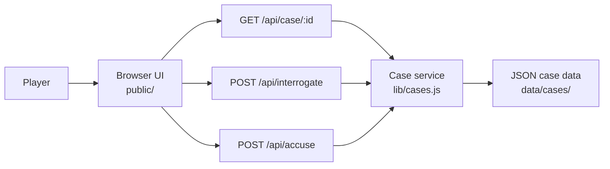

# Hồ Sơ Đen — Interactive Detective Game

An interactive browser-based detective game where players inspect evidence, interrogate suspects, compare testimonies, and make a final accusation across three difficulty levels.

**Live demo:** https://ho-so-den-detective-game.tiennt0312.chatgpt.site/

## Why this project

This project was built as a product-focused coding portfolio piece: turning a game concept into a playable web experience with clear state transitions, server-side case logic, reusable case data, and a deployable web architecture.

AI-assisted development with Codex was used during implementation. Product concept, game flow, requirements, testing, iteration, and final project decisions were directed by the project owner.

## Features

- Three investigation difficulties with separate case datasets
- Suspect profiles, motives, evidence, and case facts
- Guided interrogation flow with suspect-specific answers
- Per-suspect interview history during a session
- Final accusation flow with server-side answer checking
- Responsive detective/noir interface
- Public case API that hides culprit data and private answers from the browser

## Tech stack

- **Frontend:** HTML, CSS, JavaScript
- **UI runtime:** React 19
- **Application framework:** Vinext
- **Build tooling:** Vite
- **Server/API:** App Router-style route handlers
- **Deployment target:** Cloudflare-compatible runtime / ChatGPT Sites
- **Data:** JSON-based case datasets

## Architecture



The browser receives only the public portion of each case. Culprit IDs, final explanations, and suspect answer maps remain on the server side and are returned only through the relevant API flow.

## Project structure

```text
ho-so-den-detective-game/
├── app/
│   ├── api/
│   │   ├── accuse/route.js
│   │   ├── case/[id]/route.js
│   │   └── interrogate/route.js
│   ├── layout.js
│   └── page.js
├── data/
│   └── cases/
│       ├── easy.json
│       ├── medium.json
│       └── hard.json
├── lib/
│   └── cases.js
├── public/
│   ├── assets/
│   ├── app.js
│   ├── index.html
│   └── *.css
├── scripts/
│   └── build.mjs
├── package.json
├── vite.config.ts
└── wrangler.jsonc
```

## API overview

### `GET /api/case/:id`
Returns case information required by the UI while excluding private suspect answers and culprit metadata.

Example case IDs:

- `HS-1103` — Easy
- `HS-2507` — Medium
- `HS-4109` — Hard

### `POST /api/interrogate`
Returns the predefined response for a suspect and interrogation question.

```json
{
  "caseId": "HS-4109",
  "suspectId": "assistant",
  "questionId": "alibi"
}
```

### `POST /api/accuse`
Checks the player's final accusation and returns the result plus the case explanation.

```json
{
  "caseId": "HS-4109",
  "suspectId": "assistant"
}
```

## Run locally

### Requirements

- Node.js 20+
- npm

### Setup

```bash
npm install
npm run dev
```

Then open the local URL printed in the terminal.

## Build

```bash
npm run build
```

The build script is cross-platform and works on Windows, macOS, and Linux. If a local ChatGPT Sites hosting configuration exists at `.openai/hosting.json`, it is copied into the build output automatically; otherwise the normal application build still works.

## Design decisions

**Keep the solution server-side.** The frontend never receives `culpritId` or the complete suspect answer objects in the initial case payload.

**Use data-driven cases.** Each difficulty is represented by a JSON dataset, so new cases can be added without rewriting the main game UI.

**Separate UI and case logic.** Static UI assets live in `public/`, while server routes access case data through `lib/cases.js`.

## Possible next steps

- Persist player progress and investigation history
- Add generated or adaptive interrogation responses
- Add authentication and leaderboards
- Add automated API and gameplay tests
- Split the browser script into smaller feature modules

